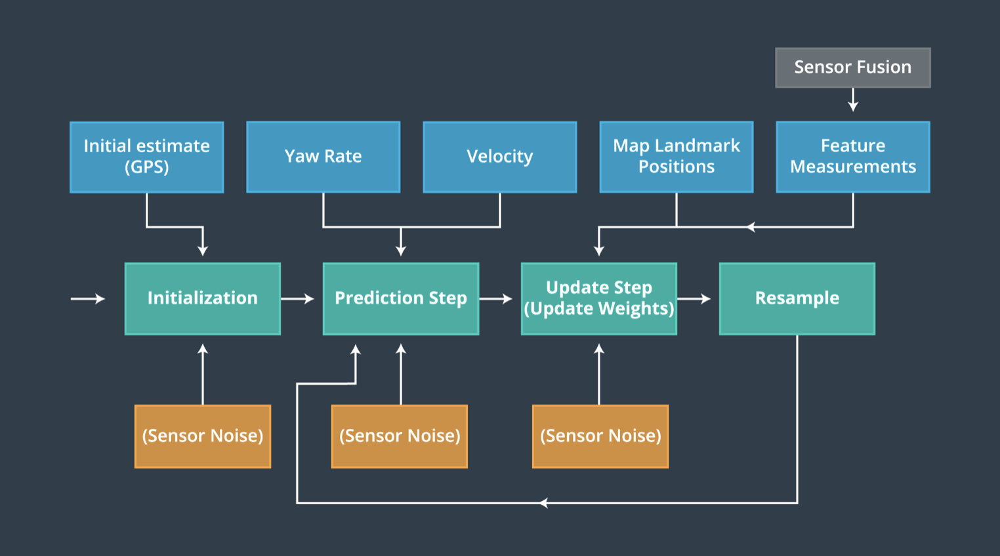
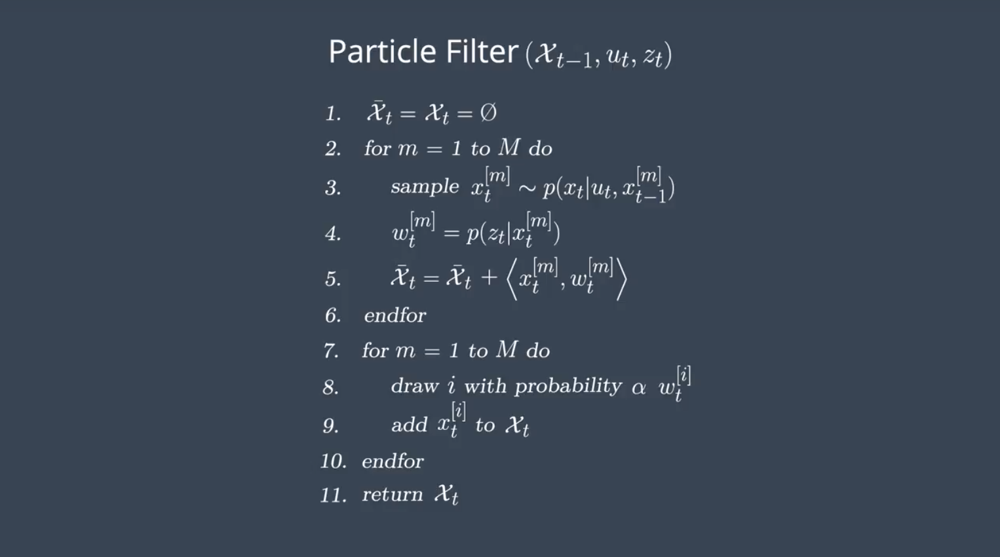
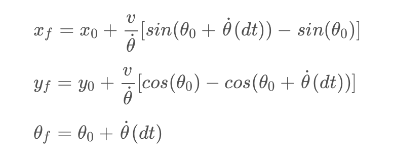
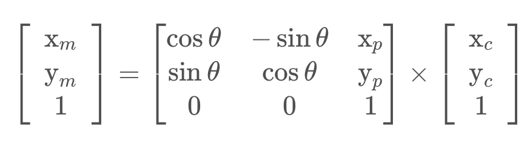
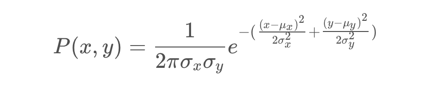
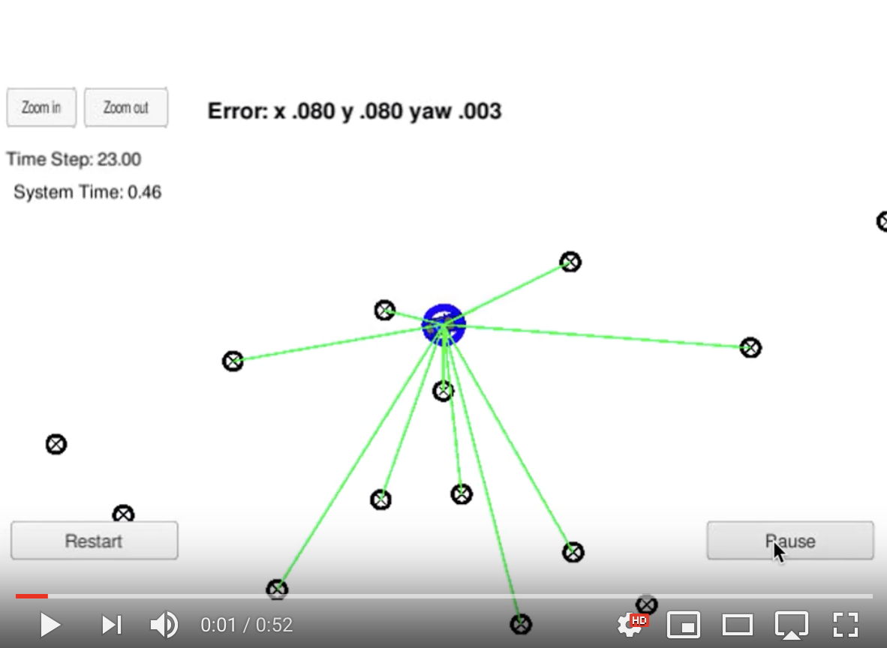

# **Particle Filter**

## **Objective**
This project describes implementation of 2 dimensional particle filter to localize a car [x, y, heading]. The particle filter will be given a map and some initial localization information, analogous to what a GPS would provide. At each time step, the filter will also get observation of landmarks [x, y] and control data [velocity, yaw rate].

## **Algorithm Overview**

  

  

The algorithm will go through the following steps:

* Initialization - The filter is initialized using GPS input. Particles are obtained by sampling a Gaussian distribution, taking into account Gaussian sensor noise around the initial GPS position and heading estimates.
* Predict - The filter predicts where the vehicle will be at the next time step using bicycle motion model, by updating based on velocity and yaw rate, while accounting for Gaussian sensor noise.
* Update - There are four sub-steps here:
  * Coordinate Transform - Measurements are transformed from its local car coordinate system to the map's coordinate system.
  * Landmark Association - Each measurement are associated with a landmark, using nearest-neighbor association.
  * Weight Calculation - The particles final weight are calculated as the product of each measurement's Multivariate-Gaussian probability density.  The Multivariate-Gaussian probability density has two dimensions, x and y. The mean of the Multivariate-Gaussian is the measurement's associated landmark position and the Multivariate-Gaussian's standard deviation is described by initial uncertainty in the x and y ranges in map frame. The Multivariate-Gaussian is evaluated at the point of the transformed measurement's position.
  * Resampling - The filter will resample N [number of particles in the filter] times, drawing each particle proportional to its weight. The new set of particles represents the Bayes filter posterior probability. We now have a refined estimate of the vehicles position based on input evidence.

**Predict**

  

**Update**

*Coordinate transform*

  

*Weight Calculation*

  

**Results**

In the video, green lines represent laser sensors from the ground truth position of the car. The car shows its ground truth position while the blue circle shows the best particle position. Number of particle used is 100.

  

